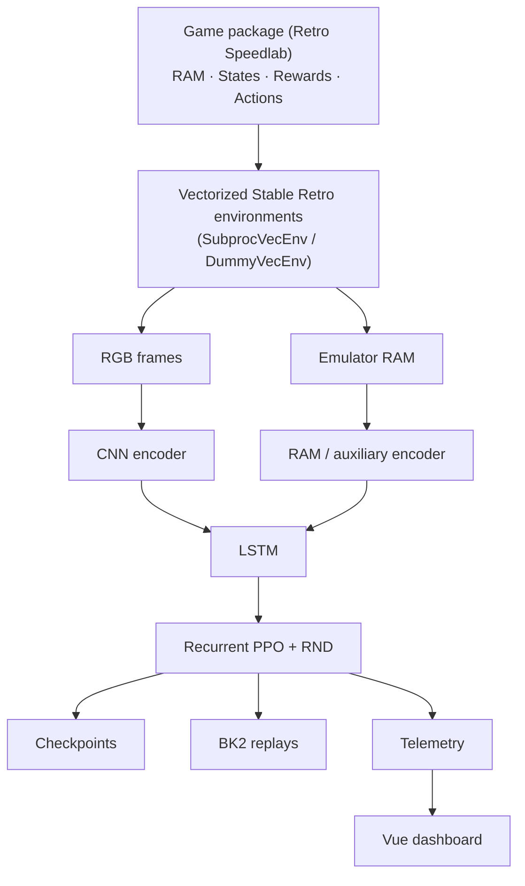

# Retro Speedlab Core

[](https://github.com/datenwissenschaften/retro-speedlab-core/actions/workflows/ci.yml)   [](https://github.com/datenwissenschaften/retro-speedlab-core/commits/main) [](LICENSE)  [](https://codecov.io/gh/datenwissenschaften/retro-speedlab-core)

Recurrent PPO + Random Network Distillation training engine for classic
video games, built on Stable-Baselines3, sb3-contrib, and Stable Retro.

Retro Speedlab Core is the reusable RL engine behind
[Retro Speedlab](https://github.com/datenwissenschaften/retro-speedlab), which
provides the project scaffold, game packages, and end-to-end tooling built on
top of this engine.

## Highlights

- Recurrent **CNN-LSTM PPO** (`sb3-contrib`) for partially observable environments
- Multi-input policies combining **RGB frames and emulator RAM**
- Adaptive **Random Network Distillation (RND)** for sparse-reward exploration,
  with a frozen target network and a trained predictor
- Vectorized emulator environments, with a bounded, cgroup-aware worker-count
  heuristic when `num_envs: auto`
- Atomic, resumable checkpoints that include policy, RND, and exploration
  adaptation state
- A `ReverseCurriculum` for mastering a sequence of in-level states with
  automatic savestate checkpointing and evidence-based rollback
- State-routed training (`StateTrainer`) that trains one recurrent policy per
  game state from a shared set of vectorized workers
- `.bk2` episode recording via Stable Retro
- Live Vue-based training telemetry over a local dashboard, persisted to Redis

## Architecture



A game package (defined in `retro-speedlab` or a compatible project) supplies
RAM structures, training states, rewards, and action translation by
subclassing this engine's `StateMachineGymWrapper`. This repository owns
everything downstream of that: environment vectorization, the model, training
loop, checkpointing, replay capture, and telemetry.

## Training pipeline

Each step produces a `{"visual": RGB frame, "ram": normalized RAM vector,
"auxiliary": optional per-state features}` dictionary observation. `sb3-contrib`'s
`MultiInputLstmPolicy` encodes the visual frame with a CNN and the RAM/auxiliary
vector with an MLP, concatenates them, and feeds the result to an LSTM before
the PPO actor-critic heads. `AdaptiveRecurrentRNDPPO` wraps this with a
Random Network Distillation reward computed from the same visual frames.

## Why recurrent PPO + RND

Many of these games are partially observable from a single frame (off-screen
state, delayed effects, multi-step sequences), so the policy carries an LSTM
hidden state across steps rather than relying on frame stacking alone.

Random Network Distillation adds an intrinsic reward proportional to how
poorly a trained predictor network reconstructs the (frozen, randomly
initialized) target network's features for the current frame — novel frames
produce a larger predictor error and a larger intrinsic reward. This gives the
agent a training signal in games where extrinsic reward is sparse. The
intrinsic coefficient anneals from an initial to a final value over
`rnd_anneal_steps`, and is additionally scaled by an adaptation multiplier
that rises when episode fitness or win rate stalls and relaxes as progress
resumes (`AdaptiveRecurrentRNDPPO._adapt_exploration`).

## Checkpointing and reproducibility

Checkpoints are written atomically: the model is saved to a temporary file in
the target directory and moved into place with `os.replace`, so a crash or
interrupted write during `model.save()` cannot leave a corrupted file at the
path the trainer reads on restart (`callbacks/save_model_callback.py`).
Loading validates the checkpoint's parameters are finite; a load failure or a
non-finite checkpoint is discarded and training restarts fresh rather than
resuming into a broken state (`model.load_or_create_model`).

For `AdaptiveRecurrentRNDPPO`, a checkpoint includes:

- policy weights and optimizer state (via Stable-Baselines3)
- the RND predictor and frozen target network weights, and the RND optimizer
- RND reward normalization statistics (running mean/variance/count) and the
  observation count used for coefficient annealing
- the adaptation multiplier and its inputs (episodes since score improvement,
  episodes since a win, recent fitness history)

This is verified by an automated round-trip test
(`tests/test_checkpoint_round_trip.py`): a model is trained for a few steps,
saved, reloaded, and its policy weights, RND weights, reward statistics, and
adaptation state are compared against the original.

**Reproducibility is semantic, not bit-exact.** Resuming training continues
from equivalent policy, RND, and exploration state, and training loss/reward
trends continue coherently — but the engine does not currently seed Python,
NumPy, PyTorch, and every vectorized worker into a single deterministic
stream, and `SubprocVecEnv` workers, CUDA kernels, and the emulator itself are
not guaranteed to replay identically. Treat resumed runs as continuing the
same training process, not as reproducing an exact trajectory.

## Vectorized execution

Environments run in `SubprocVecEnv` (or `DummyVecEnv` for a single worker),
wrapped with `VecMonitor` and `VecFrameStack`. Setting `num_envs: auto` uses a
bounded heuristic (`parallelism.optimal_env_count`) based on available CPU
count and memory, both cgroup-aware where cgroup limits are present, so a
containerized or CI environment does not oversubscribe. This heuristic is a
starting point, not a measured throughput optimization; no benchmark numbers
are published because none have been measured for this repository.

## Telemetry

The training dashboard (`ui.enable: true`, served locally by a
zero-dependency HTTP server) shows live, in-memory **aggregate** statistics —
episode counts, win rates, best fitness, durations — broken out by training
state and by savestate, plus current model/RND/environment metadata. It does
**not** retain a scrollable list of individual past episodes; only running
summaries persist to Redis so they survive a restart. (`ui.max_episodes` is
accepted for configuration compatibility but does not currently bound
anything, since no per-episode list is kept.)

Training does not fail if the dashboard is disabled; `ui.enable: false` skips
starting the HTTP server and the Redis-backed history store entirely.

## Redis persistence

Non-file training state — telemetry summaries, best-episode references,
curriculum/target-memory state, and the active savestate for rotation — is
stored in Redis under `RedisStore`, namespaced by key prefix, game identity,
and (where relevant) savestate, so unrelated experiments sharing a Redis
instance do not overwrite each other's state. Model checkpoints and `.bk2`
recordings stay on disk.

## Installation

Retro Speedlab Core requires **Python 3.12**.

Install the published package:

```bash
pip install datenwissenschaften
```

> The published PyPI package name is `datenwissenschaften` (this repository's
> pre-rename identity); the import path and package name have not been
> renamed to match the repository to avoid a breaking change. See
> [Package naming](#package-naming) below.

For local development:

```bash
git clone https://github.com/datenwissenschaften/retro-speedlab-core.git
cd retro-speedlab-core

poetry install
cp config.example.yaml config.yaml
```

## Minimal usage

This repository does not ship a runnable game; a concrete game package (RAM
layout, states, rewards, and a `StateMachineGymWrapper` subclass) is supplied
by a project such as [Retro Speedlab](https://github.com/datenwissenschaften/retro-speedlab)
or your own. Given one, training composes from this engine's public API:

```python
from datenwissenschaften import AdaptiveRecurrentRNDModel, EnvironmentBuilder, ModelBuilder, Trainer

from my_game import MyGameWrapper  # wraps a Stable Retro env into a Dict-observation
                                    # Gym env; see StateMachineGymWrapper

venv = EnvironmentBuilder(MyGameWrapper).build()
model = ModelBuilder(AdaptiveRecurrentRNDModel).build(venv, state_name="default")
Trainer(state_name="default").train(model)
```

`EnvironmentBuilder` and `RetroVecEnvBuilder` are both public vector-environment
builders; both call `wrapper(env, obs_size=obs_size)` (`obs_size` defaults to
`(96, 96)` and is configurable on either builder), so `MyGameWrapper` can rely
on the same construction contract regardless of which builder composes it
(`tests/test_environment_builder.py`).

This also requires a `config.yaml` (see below) and a ROM imported through
Stable Retro (`roms.import_roms`); the engine does not bundle or require any
commercial ROM for its own test suite.

## Configuration

Copy `config.example.yaml` to `config.yaml` and adjust it; `load_config`
validates paths, training, upload, and UI settings eagerly and raises a clear
`RuntimeError` for missing or malformed values (see `tests/test_settings.py`).
Notably:

- `training.savestate` or `training.savestates` (a rotation list) is required
- `training.num_envs` accepts a positive integer or `"auto"`
- `paths.roms`, `paths.models`, `paths.recordings`, and `paths.cache` are all required
- `ui.port` must be `1`–`65535`; `ui.max_episodes` must be `null` or positive
- `ui.enable` and the legacy `ui.enabled` key are mutually exclusive

A rotating curriculum (`StateTrainer`) that masters multiple `training.savestates`
persists the active savestate to Redis and keeps game-state features such as
`TargetMemory` (a remembered on-screen target position) scoped to it, so a
position learned under one savestate is never read back while training a
different one (`tests/test_target_memory.py`).

PPO and RND hyperparameters (`NES_PPO_DEFAULTS` in `rnd/model.py`, and the RND
constructor arguments) are Python-level defaults tuned for NES/Genesis-scale
action spaces and rollout lengths; they are not currently exposed through
`config.yaml`, but `AdaptiveRecurrentRNDPPO` validates them (e.g. RND's
`update_proportion`, `intrinsic_gamma`, `anneal_steps`, and `reward_clip`) and
raises `ValueError` for out-of-range values.

## Testing

```bash
poetry install
poetry run pytest
```

Tests run entirely on CPU with fake/minimal environments — no ROM, GPU, or
Redis server is required. This includes RND target-network immutability,
RND/policy checkpoint round-trips, recurrent-rollout GAE across interleaved
vector workers and state-segment boundaries, curriculum checkpoint logic, and
configuration validation.

## Development

```bash
poetry run ruff check .
poetry run ruff format --check .
```

After modifying the Vue dashboard frontend, rebuild its assets:

```bash
cd src/datenwissenschaften/ui/frontend
npm ci
npm run build
```

## Relationship to Retro Speedlab

- **Retro Speedlab Core** (this repository): the reusable engine — environment
  vectorization, models, training, exploration, checkpointing, telemetry, and
  Redis persistence.
- **[Retro Speedlab](https://github.com/datenwissenschaften/retro-speedlab)**:
  the project scaffold — concrete game packages, runnable entry points, and
  end-to-end examples built on this engine.

## Package naming

The repository is `retro-speedlab-core`; the published PyPI package and
import path remain `datenwissenschaften` for compatibility with existing
installations and game projects that depend on it. A rename to
`retro-speedlab-core` (or similar) is a deliberate, separately-planned
breaking change, not something this pass performs automatically.

## Limitations

- Training is semantically resumable, not bit-exact reproducible (see
  [Checkpointing and reproducibility](#checkpointing-and-reproducibility)).
- The dashboard keeps aggregate episode statistics, not a browsable history of
  individual episodes.
- `num_envs: auto` picks a bounded worker count from CPU/memory heuristics; it
  is not a measured throughput optimization.
- Binding the dashboard to `0.0.0.0` exposes it to the local network with no
  authentication; use `127.0.0.1` (the default) unless the network is trusted.
- PPO/RND hyperparameters are tuned defaults for NES/Genesis-scale games, not
  yet configurable through `config.yaml`. Making them configurable is a
  deliberate follow-up feature, not something this pass adds.

## License

Copyright © datenwissenschaften contributors.

Distributed under the [GNU General Public License v3.0](LICENSE).
