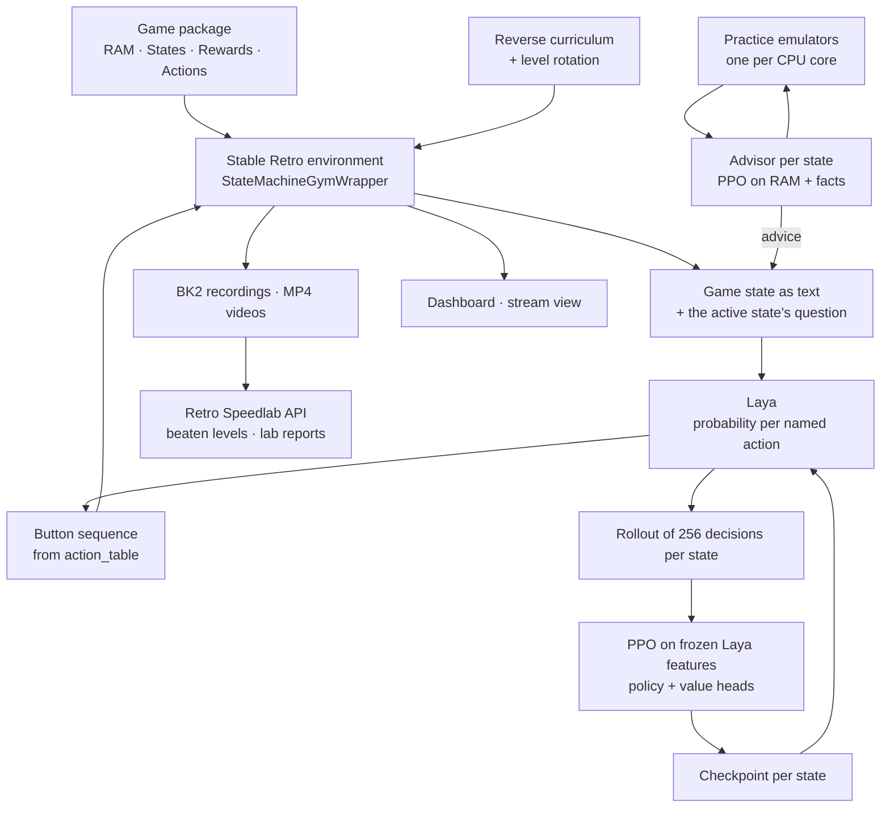

# Retro Speedlab Core

[](https://github.com/datenwissenschaften/retro-speedlab-core/actions/workflows/ci.yml)   [](https://github.com/datenwissenschaften/retro-speedlab-core/commits/main) [](LICENSE)  [](https://codecov.io/gh/datenwissenschaften/retro-speedlab-core)

Training engine for classic video games built entirely on
[Laya](https://huggingface.co/convaiinnovations/laya), a non-autoregressive
decision model. Laya reads the game state as text, answers the active state's
question with calibrated probabilities over named actions, and learns from
rewards by fine-tuning all of its weights with group-relative policy gradients.

Retro Speedlab Core is the engine behind [Retro Speedlab](https://www.retrospeedlab.com),
the lab where Laya learns to beat retro games live on Twitch. Game packages
supply the game knowledge; this repository owns everything that turns that
knowledge into a learning agent.

## Highlights

- **Laya decides every action**: one frozen forward pass reads the game as
  text and scores each named action of the active state; there is no pixel
  encoder
- **A fast advisor coaches Laya**: a small PPO network per state practises on
  every other CPU core at emulator speed; Laya reads its advice as one more
  fact and still makes every decision on the main emulator
- **PPO and imitation on Laya's features**: Laya's small policy and value heads
  learn from their own play, the advisor's advice and lab demonstrations
- **One Laya per state**: each phase of a level has its own question and its
  own checkpoint, loaded and prefetched as the state machine moves on
- **Fits a consumer GPU**: the frozen reader runs under fp16 or bf16 autocast,
  and only the heads and the advisors (a few million weights each) are trained
- **Probe and stall watch**: a probe measures which facts Laya can read back
  from its features, and the dashboard flags states whose learning is flat
- **Power-on start like a real speedrun**: every attempt boots the game at its
  title screen with every button, levels are states of one full-game run
- **Curriculum** with automatic savestates: once a phase is mastered,
  attempts start where the next phase begins; the lab can seed a phase with a
  savestate it played to from power-on
- **Vision helpers** that turn template and color detections into text facts
  and boxes on the stream
- `.bk2` recording of every attempt, MP4 rendering of the best attempts, and
  uploads of beaten levels and short lab reports to the Retro Speedlab API
- Live dashboard and a 1920×1080 stream view for OBS, backed by a file-based
  JSON database

## Architecture


```mermaid
flowchart TD
    Game["Game package<br/>RAM · States · Rewards · Actions"]
    Env["Stable Retro environment<br/>StateMachineGymWrapper"]
    Text["Game state as text<br/>+ the active state's question"]
    Laya["Laya<br/>probability per named action"]
    Practice["Practice emulators<br/>one per CPU core"]
    Advisor["Advisor per state<br/>PPO on RAM + facts"]
    Action["Button sequence<br/>from action_table"]
    Rollout["Rollout of 256 decisions per state"]
    Learner["PPO on frozen Laya features<br/>policy + value heads"]
    Models["Checkpoint per state"]
    Curriculum["Reverse curriculum<br/>+ level rotation"]
    Rec["BK2 recordings · MP4 videos"]
    UI["Dashboard · stream view"]
    API["Retro Speedlab API<br/>beaten levels · lab reports"]

    Game --> Env
    Env --> Text
    Text --> Laya
    Laya --> Action
    Action --> Env
    Laya --> Rollout
    Practice --> Advisor
    Advisor --> Practice
    Advisor -- "advice" --> Text
    Rollout --> Learner
    Learner --> Models
    Models --> Laya
    Curriculum --> Env
    Env --> Rec
    Rec --> API
    Env --> UI
```

A game package subclasses `StateMachineGymWrapper` and supplies a `RamInfo`
for the RAM it understands, the `State` classes of its state machine, an
`action_table` and one description per action. This repository owns the rest:
turning game state into Laya's input, deciding, learning, checkpointing,
curriculum, recording, uploads and telemetry.

## How Laya plays

1. **The game speaks text.** Each `State` returns a `describe()` dict built
   from verified RAM values and detections, for example
   `{"score": 120, "lives": 3, "nearest_enemy": {"direction": "up-left", "distance": 128}}`.
   Positions relative to the player belong in an `Offset(right, down)`, which
   Laya reads as `"34 right, 12 below"`: in the probe it recovered direction
   from such phrases far better than from signed numbers.
2. **Every state asks a question.** A state's `description` is the question
   Laya answers, so "reach the exit" and "survive the boss" are separate
   decisions with separate models.
3. **Every action has a meaning.** `action_table` has the shape
   `(actions, frames, buttons)`: an action is the button sequence played for one
   decision, so a game can tap a button instead of holding it.
   `action_descriptions` name each action, and those names are Laya's options.
4. **Laya decides.** One forward pass returns a probability per option. The
   option order is shuffled deterministically per state text and question, so
   Laya cannot learn a positional bias. The agent samples from a mix of Laya's
   distribution and a uniform one: 5% uniform while a state is being learned,
   1% once it is mastered. The advisors explore on the practice emulators, so
   Laya's own attempts stay precise enough for platforming.

## How the advisor coaches

Every CPU core but two runs a practice emulator without recording. A coach
thread plays them all with one small actor-critic per state (`advisor/`): its
input is the console RAM scaled to `[0, 1]` plus the state's facts hashed into
64 slots, normalized by running statistics. Advisors act and learn on the
accelerator; every 2048 decisions of a state become one PPO update (minibatch
256), with imitation of the lab demonstrations until the state is mastered. The
coach pauses while a lab run works on the game and saves `advisor.pt` next to
each state's `laya.pt`.

Hard stretches such as precise platforming are learned backwards (backplay).
Replaying the lab's demonstrations from power-on keeps a start point every 4
decisions of each stretch that leaves a state forward. A practice run that ends
in such a state restarts from one of its last start points; once half of 20
attempts leave the state forward, the start moves one point further back, until
the whole stretch is covered. Only practice emulators use these start points;
Laya's attempts always start at the curriculum's start points.
`metadata.advisors.<State>` shows `backplay` (points covered / total) and
`exits` (where practice runs leave the state).

On the main emulator the advisor's top move becomes the first fact in Laya's
text, in the words of that move's option, for example `"advised": "hold right"`.
Laya decides; the advice is only something it reads. Placement matters: as the
first fact in the option's own words, pretrained Laya follows it 97 % of the
time; as `"advisor": "right 82%"` at the end of the facts it managed 27 %, and
imitation only lifted that to 32 %. `advisor_agreement` in
`metadata.state_models` tracks how often Laya's favourite move is the advised one.

## How Laya learns

Laya's reader stays frozen. Each state trains its own small heads with PPO once
256 of its decisions on the main emulator are collected:

- the policy head is a trainable copy of Laya's option scorer and scores every
  option from its marker vector
- the value head reads the pooled vector together with every option's marker
  vector, since the game facts live mostly in the markers
- advantages use GAE (γ = 0.99, λ = 0.95). Losing a life, ending the game or
  leaving the state ends a segment; hitting the time cap only cuts it, so the
  value estimate carries on instead of counting the cap as a death
- 4 epochs of minibatch 64 with ratio clip 0.2, value weight 0.5 and entropy
  bonus 0.01; policy and value gradients are clipped to norm 0.5 separately so
  large returns cannot starve the policy
- an imitation loss pulls Laya toward the advisor's choice on every decision
  and toward the lab demonstrations until the state is mastered

A state is cut after 180 seconds of game time, counted in emulator frames, so a
slow GPU never shortens what an attempt can achieve.

## One Laya per state

`StateModels` keeps one checkpoint per state under
`models/<game>/<State>/laya.pt`. Each state's heads stay in memory once loaded
(a state without a checkpoint starts from Laya's pretrained scorer). Checkpoints hold the heads,
their optimizer and the trained decision count, and are written on a
background thread to a temporary file that replaces the old one atomically.

## Curriculum and rotation

`ReverseCurriculum` masters the states of a level in order. When an attempt
reaches a new state, the emulator state is saved as that state's checkpoint;
eight wins master a state. Only Laya's attempts on the main emulator count as
wins and failures; the practice emulators only add start points. A win only counts if it takes at most 25 % more
steps than the median of that state's last 8 wins, so faster wins pull the
limit down and mastery means fast and consistent, while one lucky fast win
never blocks it. From then on attempts start from the checkpoint
of the first unmastered state, so Laya practises the hard part instead of
replaying the easy one. Mastery is never lost; a checkpoint that keeps failing
is rebuilt from the nearest earlier mastered checkpoint.

There are no configured savestates: every attempt that does not start from a
curriculum checkpoint boots the game at power-on, so the menu (one player) is
the first state and every level is a later state of the same run. Stable
Retro's own done conditions are ignored, because they misfire on the title
screen: only the game's states end an attempt (game over). A
`<State>.state` file (the raw bytes of `em.get_state()`) in `paths.curriculum`
seeds that state's checkpoint until the engine saved its own. Once the full
game is won eight times from power-on, every attempt is a speedrun with an
extra cost per frame.

## Vision

States receive every frame. `datenwissenschaften.vision` provides a
`TemplateDetector` (template images from the game's `assets/`), a
`ColorBlobDetector` for sprites with a distinctive color, and
`describe_target`, which turns detections into text such as
`{"visible": true, "direction": "up-left", "distance": 128}`. A state returns
that from `describe()` so it becomes part of what Laya reads, and from
`detections()` so the stream draws the boxes on the replayed video.

## Recordings and uploads

Every attempt is recorded as `.bk2`. After each update, the best attempt per
curriculum state is rendered to MP4. With `upload.api_key` set:

- a level beaten from its very first frame is uploaded to the Retro Speedlab
  API as MP4, with its frame count, frame rate and Laya's model details
- every short lab report (`<report>.summary.json`, the four-line card the
  stream shows) is uploaded whenever it is new or has changed

Failed uploads are retried after the next update; without an API key nothing
is uploaded.

## Dashboard and stream view

With `ui.enable: true` the dashboard runs at `http://127.0.0.1:18080`. It shows
per-state and per-level statistics, the model, the curriculum and the lab
reports, and offers a CSRF-protected model reset. `/stream` is a 1920×1080 page
for OBS: training records every frame with the decision behind it, and the
page replays that recording at a steady frame rate a few seconds behind live,
so learning pauses never freeze the stream. With `twitch.enabled: true`, free
models on OpenRouter (`OPENROUTER_API_KEY`) write the short version of the
latest lab report for the stream.

## Persistence

Training state that is not a file (statistics, curriculum progress, the level
rotation and the training identity) lives in one JSON file (`paths.database`)
written atomically. The training identity stores the engine's major and minor
version, `training.fingerprint` and the model layout; when any of them changes,
the models and curriculum of that game are reset instead of resuming into an
incompatible state.

## Installation

Retro Speedlab Core requires **Python 3.12**.

```bash
git clone https://github.com/datenwissenschaften/retro-speedlab-core.git
cd retro-speedlab-core
poetry install
cp config.example.yaml config.yaml
```

The published package and import path are `datenwissenschaften`.

## Minimal usage

This repository does not ship a playable game; a game package supplies the RAM
layout, states, rewards and actions:

```python
from pathlib import Path

import numpy as np

from datenwissenschaften.environment.wrapper import StateMachineGymWrapper
from datenwissenschaften.training.trainer import LayaTrainer


class AirstrikerWrapper(StateMachineGymWrapper[AirstrikerRam]):
    start_state_cls = SurviveAndScore
    state_classes = (SurviveAndScore,)
    ram_info_cls = AirstrikerRam
    action_table = np.array([[[1] + [0] * 11, [0] * 12, [0] * 12, [0] * 12]], dtype=np.int8)
    action_descriptions = {"fire": "hold position and shoot straight ahead"}


LayaTrainer(AirstrikerWrapper, Path("config.yaml")).train()
```

The ROM is imported through Stable Retro from `paths.roms`; the engine's own
test suite needs no ROM.

Before shipping new facts, probe them:

```python
from datenwissenschaften.probe.run import probe

probe(AirstrikerWrapper, Path("config.yaml"), 300, 0)
```

The probe plays the given number of random decisions from every lab seed in
`paths.curriculum` inside a scratch curriculum, then fits a ridge readout from
Laya's features to every numeric fact and logs its held-out R². Any `Offset`
below R² 0.5 raises `UnreadableFacts`.

## Configuration

Every key in `config.example.yaml` is required; missing or malformed values
raise a `RuntimeError` when the configuration is loaded.

| Key | Meaning |
|-----|---------|
| `paths.*` | ROMs, models, recordings, cache, the JSON database, the lab reports and the curriculum seeds |
| `training.game` | Stable Retro game id |
| `training.fingerprint` | Changing it resets the game's models and curriculum |
| `laya.checkpoint` | Laya model on the Hugging Face Hub or a local directory |
| `upload.url`, `upload.api_key` | Retro Speedlab API; `null` disables uploads |
| `ui.*` | Dashboard address, history size, release label and the persona shown on stream |
| `twitch.enabled`, `twitch.summary_models` | Short lab reports for the stream via OpenRouter |

## Testing

```bash
poetry run pytest --cov
```

Tests run on CPU with a fake Laya, a fake tokenizer and a scripted emulator, so
they need no GPU, ROM or model download. They cover the learner and trust
region, per-state checkpoints, the curriculum, rotation, uploads, telemetry
and configuration validation.

## Development

```bash
poetry run ruff check .
poetry run ruff format --check .
```

After modifying the Vue dashboard, rebuild its assets:

```bash
cd src/datenwissenschaften/ui/frontend
npm ci
npm run build
```

## Relationship to Retro Speedlab

- **Retro Speedlab Core** (this repository): the engine: Laya decisions,
  learning, per-state checkpoints, curriculum, recording, uploads and
  telemetry.
- **Game packages**: one repository per game with its RAM map, states,
  rewards, actions and Dokku deployment, grown daily by scheduled lab runs.
- **[retrospeedlab.com](https://www.retrospeedlab.com)**: the lab's website,
  showing the stream, beaten levels and lab reports uploaded by this engine.

## Limitations

- Training runs one emulator per CPU core, minus two. Only the first one, on
  the stream, is played by Laya, at the speed of one Laya read per decision;
  the others are played by the advisors at emulator speed (about 750
  decisions per second with ten practice emulators on a laptop RTX 3060).
- The advisor only knows the RAM and the facts. A state whose reward never
  pays for progress stays flat for both models; the stall watch flags it after
  200 000 decisions.
- Laya only knows what the game package describes. Unmapped RAM, such as an
  enemy that was never measured, is invisible to it.
- Laya's 421M weights stay frozen; a state checkpoint stores only its small
  policy and value heads plus their optimizer, and every state's heads stay in
  memory.
- Training is resumable, not bit-exact reproducible: sampling, CUDA kernels and
  the emulator are not seeded into one deterministic stream.
- Binding the dashboard to `0.0.0.0` exposes it to the network without
  authentication; keep `127.0.0.1` unless the network is trusted.

## License

Copyright © datenwissenschaften contributors.

Distributed under the [GNU General Public License v3.0](LICENSE).
