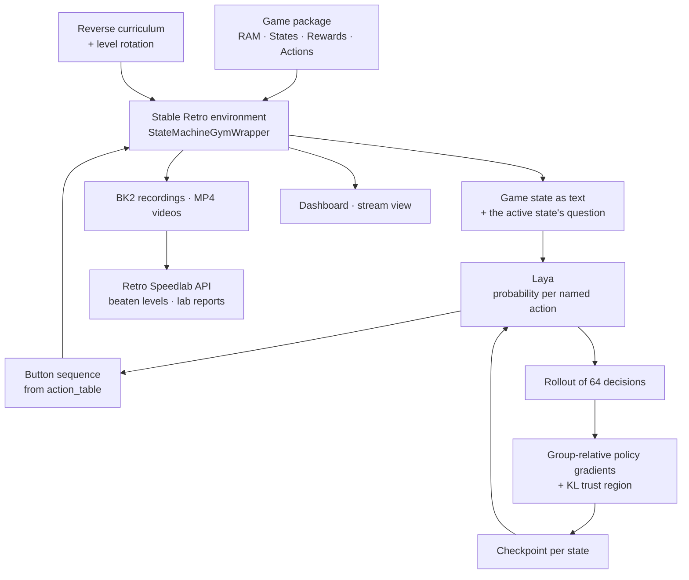

# Retro Speedlab Core

[](https://github.com/datenwissenschaften/retro-speedlab-core/actions/workflows/ci.yml)   [](https://github.com/datenwissenschaften/retro-speedlab-core/commits/main) [](LICENSE)  [](https://codecov.io/gh/datenwissenschaften/retro-speedlab-core)

Training engine for classic video games built entirely on
[Laya](https://huggingface.co/convaiinnovations/laya), a non-autoregressive
decision model. Laya reads the game state as text, answers the active state's
question with calibrated probabilities over named actions, and learns from
rewards by fine-tuning all of its weights with group-relative policy gradients.

Retro Speedlab Core is the engine behind [Retro Speedlab](https://www.retrospeedlab.com),
the lab where Laya learns to beat retro games live on Twitch. Game packages
supply the game knowledge; this repository owns everything that turns that
knowledge into a learning agent.

## Highlights

- **Laya decides every action**: one forward pass scores each named action of
  the active state; there is no critic and no pixel encoder
- **Group-relative policy gradients** with a measured-KL trust region that
  backtracks oversized updates and adapts the learning rate
- **One Laya per state**: each phase of a level has its own question and its
  own checkpoint, loaded and prefetched as the state machine moves on
- **Fits a consumer GPU**: bf16 (or fp16 with gradient scaling), gradient
  checkpointing and 8-bit AdamW train every weight in about 6 GB
- **Power-on start like a real speedrun**: every attempt boots the game at its
  title screen with every button, levels are states of one full-game run
- **Curriculum** with automatic savestates: once a phase is mastered,
  attempts start where the next phase begins; the lab can seed a phase with a
  savestate it played to from power-on
- **Vision helpers** that turn template and color detections into text facts
  and boxes on the stream
- `.bk2` recording of every attempt, MP4 rendering of the best attempts, and
  uploads of beaten levels and short lab reports to the Retro Speedlab API
- Live dashboard and a 1920×1080 stream view for OBS, backed by a file-based
  JSON database

## Architecture


```mermaid
flowchart TD
    Game["Game package<br/>RAM · States · Rewards · Actions"]
    Env["Stable Retro environment<br/>StateMachineGymWrapper"]
    Text["Game state as text<br/>+ the active state's question"]
    Laya["Laya<br/>probability per named action"]
    Action["Button sequence<br/>from action_table"]
    Rollout["Rollout of 64 decisions"]
    Learner["Group-relative policy gradients<br/>+ KL trust region"]
    Models["Checkpoint per state"]
    Curriculum["Reverse curriculum<br/>+ level rotation"]
    Rec["BK2 recordings · MP4 videos"]
    UI["Dashboard · stream view"]
    API["Retro Speedlab API<br/>beaten levels · lab reports"]

    Game --> Env
    Env --> Text
    Text --> Laya
    Laya --> Action
    Action --> Env
    Laya --> Rollout
    Rollout --> Learner
    Learner --> Models
    Models --> Laya
    Curriculum --> Env
    Env --> Rec
    Rec --> API
    Env --> UI
```

A game package subclasses `StateMachineGymWrapper` and supplies a `RamInfo`
for the RAM it understands, the `State` classes of its state machine, an
`action_table` and one description per action. This repository owns the rest:
turning game state into Laya's input, deciding, learning, checkpointing,
curriculum, recording, uploads and telemetry.

## How Laya plays

1. **The game speaks text.** Each `State` returns a `describe()` dict built
   from verified RAM values and detections, for example
   `{"score": 120, "lives": 3, "nearest_enemy": {"direction": "up-left", "distance": 128}}`.
2. **Every state asks a question.** A state's `description` is the question
   Laya answers, so "reach the exit" and "survive the boss" are separate
   decisions with separate models.
3. **Every action has a meaning.** `action_table` has the shape
   `(actions, frames, buttons)`: an action is the button sequence played for one
   decision, so a game can tap a button instead of holding it.
   `action_descriptions` name each action, and those names are Laya's options.
4. **Laya decides.** One forward pass returns a probability per option. The
   option order is shuffled deterministically per state text and question, so
   Laya cannot learn a positional bias. The agent samples from a mix of Laya's
   distribution and a uniform one: 20% uniform while a state is being learned,
   5% once it is mastered.

## How Laya learns

After 64 decisions in a state, that state's rollout becomes one update
(`GroupRelativeLearner`):

- discounted rewards-to-go (γ = 0.99, reset at episode ends and state changes)
  are normalized across the group into advantages; there is no value network
- advantages are weighted by the ratio of Laya's probability to the sampled
  behavior probability, which corrects for the uniform exploration mix
- the loss is the weighted negative log-likelihood of the chosen actions minus
  a small entropy bonus (0.001); gradients are clipped to norm 1.0
- 8-bit AdamW updates the encoder and the decision head with separate learning
  rates (1e-9 and 1e-8, scaled by the trust region)

The trust region keeps every update close to the policy that played. After a
step it measures the KL divergence to the probabilities recorded during the
rollout. Above twice the target of 0.01, it blends the weights back towards the
pre-update snapshot (up to three backtracks, then a full revert). The learning
rate scale then shrinks after oversized steps and grows after timid ones,
bounded to `[1e-2, 1e3]`.

## One Laya per state

`StateModels` keeps one checkpoint per state under
`models/<game>/<State>/laya.pt`. A state transition ends that
model's trajectory, loads the next state's checkpoint (a state without one
starts from the pretrained Laya), and prefetches the following state in the
background. Checkpoints hold all Laya weights, the optimizer, the trust region
and the gradient scaler, and are written on a background thread to a temporary
file that replaces the old one atomically.

## Memory budget

The whole model is trainable on a 6 GB GPU:

- bf16 autocast, or fp16 with a `GradScaler` on GPUs without native bf16
- gradient checkpointing in the encoder and the decision head
- 8-bit AdamW states from bitsandbytes
- minibatches of 16 on GPUs with at least 7.5 GB, otherwise 8

## Curriculum and rotation

`ReverseCurriculum` masters the states of a level in order. When an attempt
reaches a new state, the emulator state is saved as that state's checkpoint;
eight wins master a state. A win only counts if it takes at most 25 % more
steps than the fastest win of that state so far, so every faster win tightens
the limit and mastery means fast, not just lucky. From then on attempts start from the checkpoint
of the first unmastered state, so Laya practises the hard part instead of
replaying the easy one. Mastery is never lost; a checkpoint that keeps failing
is rebuilt from the nearest earlier mastered checkpoint.

There are no configured savestates: every attempt that does not start from a
curriculum checkpoint boots the game at power-on, so the menu (one player) is
the first state and every level is a later state of the same run. Stable
Retro's own done conditions are ignored, because they misfire on the title
screen: only the game's states end an attempt (game over). A
`<State>.state` file (the raw bytes of `em.get_state()`) in `paths.curriculum`
seeds that state's checkpoint until the engine saved its own. Once the full
game is won eight times from power-on, every attempt is a speedrun with an
extra cost per frame.

## Vision

States receive every frame. `datenwissenschaften.vision` provides a
`TemplateDetector` (template images from the game's `assets/`), a
`ColorBlobDetector` for sprites with a distinctive color, and
`describe_target`, which turns detections into text such as
`{"visible": true, "direction": "up-left", "distance": 128}`. A state returns
that from `describe()` so it becomes part of what Laya reads, and from
`detections()` so the stream draws the boxes on the replayed video.

## Recordings and uploads

Every attempt is recorded as `.bk2`. After each update, the best attempt per
curriculum state is rendered to MP4. With `upload.api_key` set:

- a level beaten from its very first frame is uploaded to the Retro Speedlab
  API as MP4, with its frame count, frame rate and Laya's model details
- every short lab report (`<report>.summary.json`, the four-line card the
  stream shows) is uploaded whenever it is new or has changed

Failed uploads are retried after the next update; without an API key nothing
is uploaded.

## Dashboard and stream view

With `ui.enable: true` the dashboard runs at `http://127.0.0.1:18080`. It shows
per-state and per-level statistics, the model, the curriculum and the lab
reports, and offers a CSRF-protected model reset. `/stream` is a 1920×1080 page
for OBS: training records every frame with the decision behind it, and the
page replays that recording at a steady frame rate a few seconds behind live,
so learning pauses never freeze the stream. With `twitch.enabled: true`, free
models on OpenRouter (`OPENROUTER_API_KEY`) write the short version of the
latest lab report for the stream.

## Persistence

Training state that is not a file (statistics, curriculum progress, the level
rotation and the training identity) lives in one JSON file (`paths.database`)
written atomically. The training identity stores the engine's major and minor
version, `training.fingerprint` and the model layout; when any of them changes,
the models and curriculum of that game are reset instead of resuming into an
incompatible state.

## Installation

Retro Speedlab Core requires **Python 3.12**.

```bash
git clone https://github.com/datenwissenschaften/retro-speedlab-core.git
cd retro-speedlab-core
poetry install
cp config.example.yaml config.yaml
```

The published package and import path are `datenwissenschaften`.

## Minimal usage

This repository does not ship a playable game; a game package supplies the RAM
layout, states, rewards and actions:

```python
from pathlib import Path

import numpy as np

from datenwissenschaften.environment.wrapper import StateMachineGymWrapper
from datenwissenschaften.training.trainer import LayaTrainer


class AirstrikerWrapper(StateMachineGymWrapper[AirstrikerRam]):
    start_state_cls = SurviveAndScore
    state_classes = (SurviveAndScore,)
    ram_info_cls = AirstrikerRam
    action_table = np.array([[[1] + [0] * 11, [0] * 12, [0] * 12, [0] * 12]], dtype=np.int8)
    action_descriptions = {"fire": "hold position and shoot straight ahead"}


LayaTrainer(AirstrikerWrapper, Path("config.yaml")).train()
```

The ROM is imported through Stable Retro from `paths.roms`; the engine's own
test suite needs no ROM.

## Configuration

Every key in `config.example.yaml` is required; missing or malformed values
raise a `RuntimeError` when the configuration is loaded.

| Key | Meaning |
|-----|---------|
| `paths.*` | ROMs, models, recordings, cache, the JSON database, the lab reports and the curriculum seeds |
| `training.game` | Stable Retro game id |
| `training.fingerprint` | Changing it resets the game's models and curriculum |
| `laya.checkpoint` | Laya model on the Hugging Face Hub or a local directory |
| `upload.url`, `upload.api_key` | Retro Speedlab API; `null` disables uploads |
| `ui.*` | Dashboard address, history size, release label and the persona shown on stream |
| `twitch.enabled`, `twitch.summary_models` | Short lab reports for the stream via OpenRouter |

## Testing

```bash
poetry run pytest --cov
```

Tests run on CPU with a fake Laya, a fake tokenizer and a scripted emulator, so
they need no GPU, ROM or model download. They cover the learner and trust
region, per-state checkpoints, the curriculum, rotation, uploads, telemetry
and configuration validation.

## Development

```bash
poetry run ruff check .
poetry run ruff format --check .
```

After modifying the Vue dashboard, rebuild its assets:

```bash
cd src/datenwissenschaften/ui/frontend
npm ci
npm run build
```

## Relationship to Retro Speedlab

- **Retro Speedlab Core** (this repository): the engine: Laya decisions,
  learning, per-state checkpoints, curriculum, recording, uploads and
  telemetry.
- **Game packages**: one repository per game with its RAM map, states,
  rewards, actions and Dokku deployment, grown daily by scheduled lab runs.
- **[retrospeedlab.com](https://www.retrospeedlab.com)**: the lab's website,
  showing the stream, beaten levels and lab reports uploaded by this engine.

## Limitations

- Training runs one emulator per CPU core, minus two (on the stream is the
  first one; the others practise in worker processes). Laya reads all their
  situations in one batch per step; the GPU caps this at about 100 decisions
  per second on an RTX 2070. Each state learns after 256 decisions.
- Laya only knows what the game package describes. Unmapped RAM, such as an
  enemy that was never measured, is invisible to it.
- Laya's 421M weights stay frozen; a state checkpoint stores only its small
  policy and value heads plus their optimizer, and every state's heads stay in
  memory.
- Training is resumable, not bit-exact reproducible: sampling, CUDA kernels and
  the emulator are not seeded into one deterministic stream.
- Binding the dashboard to `0.0.0.0` exposes it to the network without
  authentication; keep `127.0.0.1` unless the network is trusted.

## License

Copyright © datenwissenschaften contributors.

Distributed under the [GNU General Public License v3.0](LICENSE).
